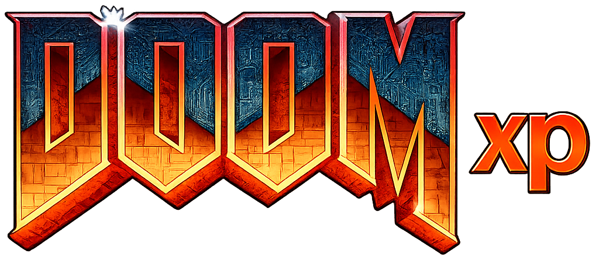
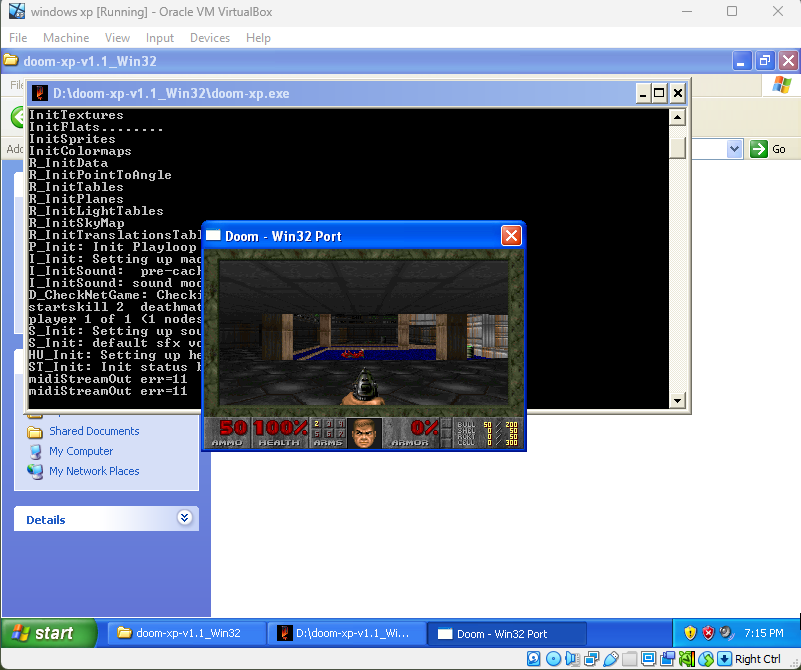

# DOOM XP

<p align="center">
  
</p>

<p align="center">
  A lightweight Windows XP-compatible build of the original DOOM engine.
</p>

---

## Screenshot

<p align="center">
  
</p>

---

## About

DOOM XP is an experimental Windows XP-compatible port of the original
open-source DOOM engine. It was compiled from the original DOOM source code
using **Open Watcom**.

The goal of this project is to create a lightweight DOOM port that can run on
older computers and operating systems while using classic development tools.

---

## Features

- ✅ Windows XP compatible
- ✅ Compiled with Open Watcom
- ✅ Lightweight executable
- ✅ Built-in launcher GUI
- ✅ Working wall textures
- ✅ Sound effects support
- ✅ Embedded icon
- ✅ Fullscreen mode

---

## How To Run

1. Download the latest release.
2. Extract the `.zip` file.
3. Run `doom-xp.exe`.
4. In the launcher, click **Browse...** and select your WAD file.
5. Configure settings (fullscreen, sound, etc.).
6. Click **LAUNCH**.

Supported WAD files: `DOOM.WAD`, `DOOM2.WAD`, `DOOM2F.WAD`, `DOOMU.WAD`,
`DOOM1.WAD`, `TNT.WAD`, `PLUTONIA.WAD`.

---

## Known Issues

- ❌ MIDI music does not play (sound effects work but music is silent)

---

## Requirements

- Windows XP SP3 or newer
- DOOM IWAD file (`DOOM.WAD` or `DOOM2.WAD`)

---

## Files

```
doom-xp.exe   - Game executable
README.txt    - Full documentation
```

---

## v1.1 Changelog

- Built-in launcher with WAD browser, fullscreen/sound/console toggles
- Wall texture rendering fixed (struct alignment bug)
- Sound effects enabled
- Fullscreen mode creates a proper WS_POPUP window
- Embedded icon (no separate patching needed)
- Logo loaded from doomxp.png

---

## v1.0 Changelog

- Initial Windows XP port of Linux Doom 1.10
- Command-line WAD selection
- 32-bit DIB section rendering

---

## Credits

- **id Software** — Original DOOM engine
- **Open Watcom Project** — Compiler
- DOOM XP contributors

---

<p align="center">
  <i>Unofficial fan project. Not affiliated with id Software.</i><br>
  <i>Built for Windows XP • Compiled with Open Watcom</i>
</p>
